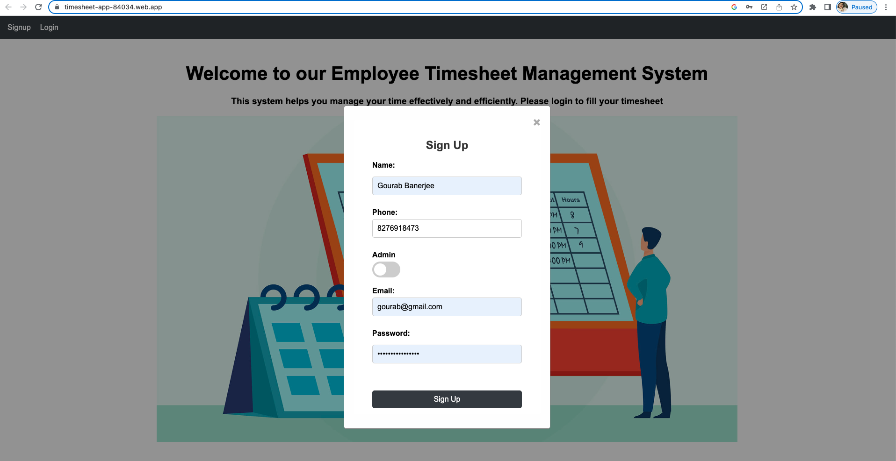
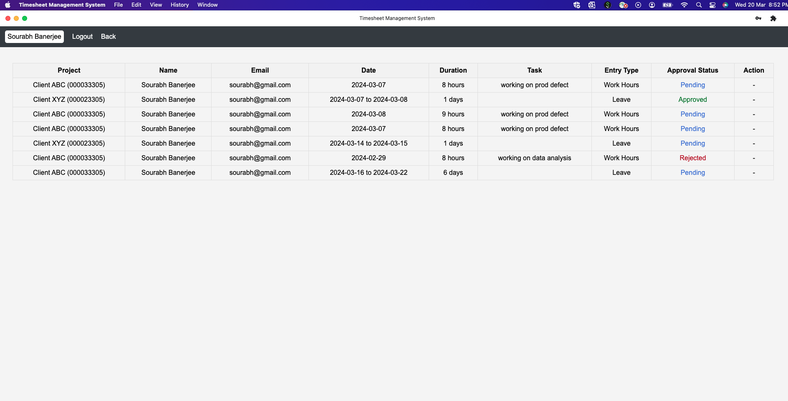

# Time-Sheet Management System (TMS)

## Introduction
This project aims to create a Time-Sheet Management System with features tailored for both employees and managers. Employees can log their work hours or leave days, view their time-sheet status, and sign up for the system. Managers have additional capabilities such as viewing time-sheet data and approving or rejecting time-sheets.
URL - https://timesheet-app-84034.web.app/

## Features

### For Employees
- **Login**: Users can log in to their accounts using their credentials.
- **Fill Time-Sheet**:
  - Two types of time-sheet entries: work hours and leave days.
  - Time-sheet entries require details such as type, date, start time, end time, and description.
- **View Time-Sheet**: Employees can view their time-sheet entries along with their status (pending, approved, or rejected).
- **Sign Up**: New users can register using name, Gmail, Password, Phone number. 
- **Note-** Also, an option available for registering as admin user role. This is for testing purpose in actual world we won’t allow any user to sign up with admin role.

### For Managers
- **Login**: Managers can log in to their accounts using their credentials.
- **View Time-Sheet Data**: Managers have access to view all time-sheet data submitted by employees.
- **Approve/Reject Time-Sheet**: Managers can approve or reject time-sheet entries submitted by employees.
- **Create Admin Account**: A manager account with admin privileges can be created using predefined credentials.

## Progressive Web Application (PWA)
- **Installable**: The website is installable on supported devices like on desktop and mobile.
- **Notifications**:
  - Managers receive notifications when employees submit time-sheet entries.
  - Employees receive notifications when managers take action on their time-sheets.
- **Offline Support**: Static resources are cached to provide offline support.

## Firebase Integration
- **Database**: Firestore is used to store time-sheet data. We have two collection users collection for managining user data like role, personal information and timesheet collection for managing timesheet or leave information
- **File Storage**: Firebase Storage is used to store uploaded leave emails.
- **Security Rules**: Appropriate security rules are applied to the database and storage. Only authorized user can access it.
- **Authentication**: Firebase Authentication i.e. email and password strategy is used to manage user authentication.
- **Hosting**: The application is hosted on Firebase Hosting. (URL -https://timesheet-app-84034.web.app/)
- **Sharing Project**: The project is shared on Firebase with designated email addresses as admin users.

## Project Setup
1. Clone the repository `git clone https://github.com/gourabb8273/PWA-Timesheet-App.git`
2. Install dependencies using `npm install`. 
3. Build the app using webpack command i.e.  `npm run build` 
3. Install the live-server extension in vs-code and run the server in the broswer and open the dist folder to see the application
5. Deploy the application to Firebase using `firebase deploy`. Application URL - https://timesheet-app-84034.web.app/

## Application Snapshots

1. Home Page

2. Login Page

3. Signup Page

4. Admin Side
   - **Dashboard Page**: Admin can also add timesheet and leave but can't approve or reject those requests.
   

   - **View/Manage Timesheet Page**
   

   - **Leave Page**
   

   - **Timesheet Page**
   

5. User Side (Non Admin)
   - **Dashboard Page**: Here the user can only view timesheet and leave, can't manage.
   

   - **View Timesheet Page**
   

   - **Leave Page**
   

   - **Timesheet Page**
   

6. Desktop View

7. Mobile View
   
   
